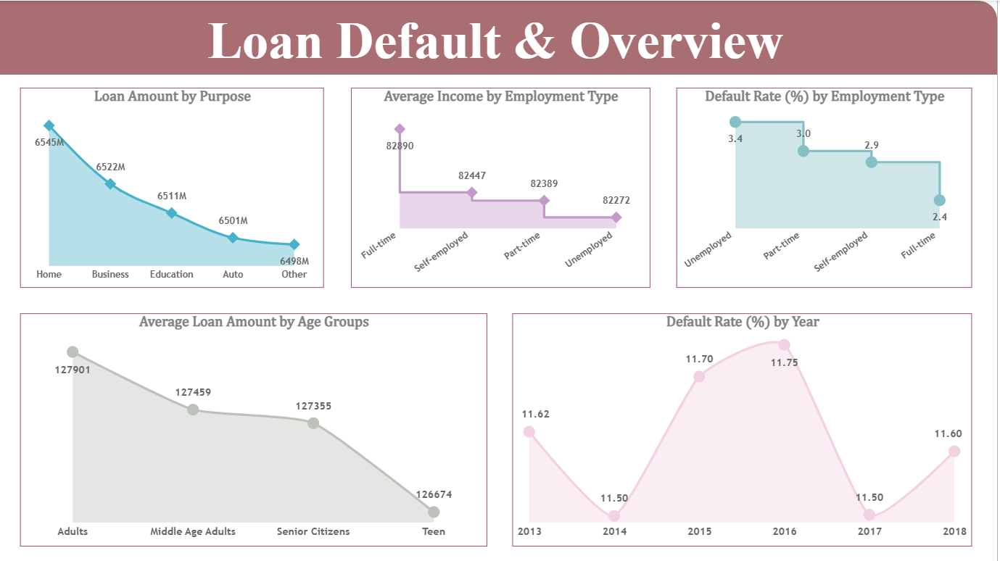
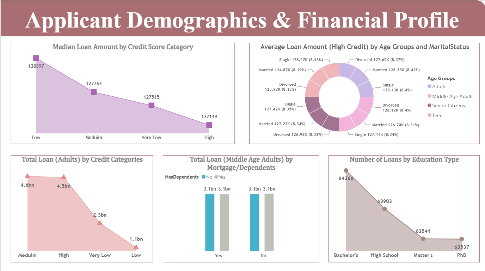
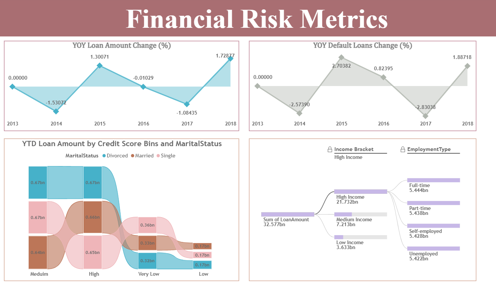

# 📊 Loan Default Risk Analysis Dashboard


An interactive **Business Intelligence (BI)** dashboard developed using **Power BI** to analyze loan portfolios, borrower demographics, credit risk, and default trends. The dashboard provides meaningful insights that support **data-driven lending decisions** through dynamic visualizations and business KPIs.

---

## 📌 Project Overview

Financial institutions must continuously evaluate borrower risk to minimize loan defaults and improve lending strategies. This project analyzes historical loan data to identify patterns across borrower demographics, income, employment type, education, credit score, and loan purpose.

The dashboard enables users to monitor portfolio performance, assess credit risk, and explore key financial metrics using interactive reports.

---

## ❓ Business Problem

Financial institutions process thousands of loan applications every year. Identifying high-risk borrowers before loan approval is critical to minimizing financial losses and improving lending decisions.

This dashboard enables analysts to evaluate borrower behavior, identify default trends, monitor portfolio performance, and assess credit risk through interactive Business Intelligence reports.

---

# 🎯 Objectives

- Analyze borrower demographics and loan distribution.
- Identify factors contributing to loan defaults.
- Evaluate credit risk across different customer segments.
- Monitor loan portfolio performance over time.
- Develop an interactive dashboard for business decision-making.

---

# 🛠 Tech Stack

| Technology | Purpose |
|------------|---------|
| **Power BI** | Dashboard Development & Data Visualization |
| **Microsoft Excel** | Data Source |
| **Power Query** | Data Cleaning & Transformation |
| **DAX** | KPI Calculations & Business Metrics |

---

# 📂 Dataset

- **Format:** Microsoft Excel (.xlsx)
- **Domain:** Banking & Financial Services

### Dataset includes:

- Loan Amount
- Borrower Income
- Employment Type
- Education
- Marital Status
- Credit Score
- Loan Purpose
- Age Group
- Default Status
- Loan Year

---

# 🔄 Data Preparation

The dataset was imported into Power BI from Microsoft Excel and transformed using **Power Query**.

### Data preprocessing included:

- Importing data from Excel
- Validating data types
- Handling missing values
- Removing duplicate records
- Formatting numerical fields
- Creating calculated columns
- Developing DAX measures
- Preparing the data model for reporting

---

# 📊 Dashboard Features

## 📌 Loan Portfolio Overview

- Loan Amount by Purpose
- Average Income by Employment Type
- Default Rate by Employment Type
- Average Loan Amount by Age Group
- Default Rate Trend by Year

---

## 📌 Borrower Demographics

- Credit Score Analysis
- Age Group Distribution
- Marital Status Analysis
- Education-wise Loan Distribution
- Mortgage & Dependents Analysis

---

## 📌 Financial Risk Metrics

- Year-over-Year Loan Growth
- Default Loan Growth
- Credit Score Analysis
- Income Bracket Analysis
- Employment Risk Segmentation

---

# 📈 Key Performance Indicators

The dashboard tracks:

- Total Loan Amount
- Average Loan Amount
- Average Borrower Income
- Default Rate
- Credit Score Distribution
- Loan Distribution
- Employment-wise Analysis
- Income-wise Analysis
- Year-over-Year Loan Trends
- Borrower Demographics

---

## 📊 Business Value

This dashboard helps financial institutions:

- Assess borrower credit risk across customer segments.
- Monitor loan portfolio performance using interactive KPIs.
- Identify high-risk borrower profiles for better lending decisions.
- Analyze default trends across employment, income, and demographic categories.

---

## 📷 Dashboard Preview

### 🏦 Loan Portfolio Overview



---

### 👥 Borrower Demographics



---

### 📈 Financial Risk Metrics



---

# 📌 Key Business Insights

- Full-time employed borrowers exhibit comparatively lower default rates than unemployed applicants.
- Borrowers with higher credit scores generally demonstrate better repayment behavior.
- Home loans contribute the largest share of the overall loan portfolio.
- Income level and employment type significantly influence borrower risk.
- Interactive filtering enables detailed analysis across borrower demographics and financial indicators.

---

# 📌 Project Outcomes

- Developed an interactive **Power BI dashboard** to monitor loan portfolio performance and borrower risk.
- Built **DAX measures** and **Power Query transformations** for automated reporting and KPI generation.
- Enabled interactive borrower segmentation using demographic and financial attributes.
- Delivered actionable insights to support data-driven lending and credit risk assessment.

 ---

# 🚀 Dashboard Capabilities

✔ Interactive Filters

✔ Dynamic Slicers

✔ Drill-down Analysis

✔ Cross-filtering

✔ KPI Dashboard

✔ Business Intelligence Reporting

✔ Trend Analysis

✔ Financial Risk Assessment

---

# 📚 Skills Demonstrated

- Business Intelligence
- Power BI Dashboard Development
- Data Visualization
- Financial Analytics
- Credit Risk Analysis
- Power Query
- DAX
- Data Modeling
- KPI Development
- Interactive Reporting
- Business Storytelling

---

# 📁 Repository Structure

```
Loan-Default-Risk-Analysis
│
├── README.md
├── loan-default-dashboard.pbix
│
├── Dataset
│   └── loan_default_dataset.xlsx
│
├── screenshots
│   ├── loan-default-overview.png
│   ├── borrower-demographics.png
│   └── financial-risk-analysis.png
│

```

---

# ▶️ How to Run

1. Clone the repository.

```bash
git clone https://github.com/Nv18/Loan-Default-Risk-Analysis.git
```

2. Open **loan-default-dashboard.pbix** using **Microsoft Power BI Desktop**.

3. Update the Excel file path if required.

4. Refresh the data to load the dashboard.

---

# 🔮 Future Enhancements

- Integrate SQL Server as the data source
- Deploy the dashboard using Power BI Service
- Add real-time data refresh
- Develop a machine learning model for loan default prediction
- Create predictive credit risk scoring
- Build an automated ETL pipeline

---

# 👨‍💻 Author

**Nikhil Kumar Singh**

B.Tech, Electronics & Communication Engineering

National Institute of Technology Silchar

**GitHub:** <https://github.com/Nv18>

**Repository:** <https://github.com/Nv18/Loan-Default-Risk-Analysis>

---

## ⭐ If you found this project helpful, consider giving it a star!
